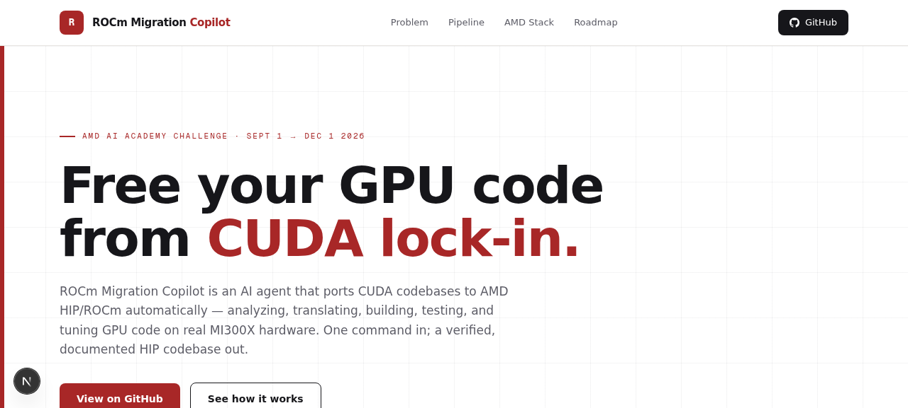
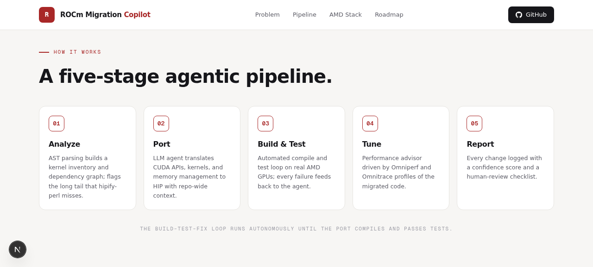
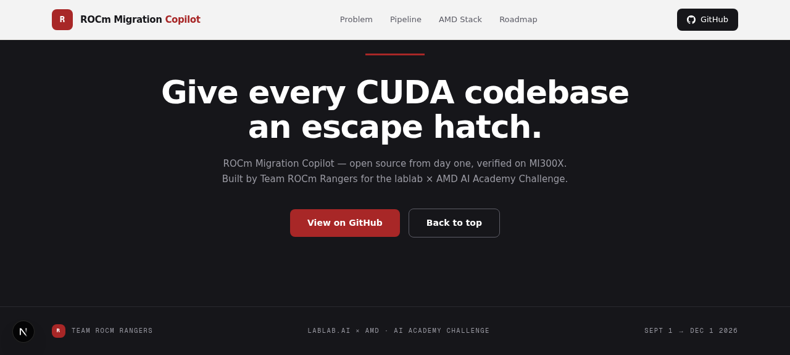
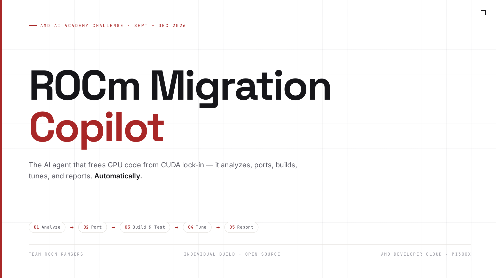

# ROCm Migration Copilot

**The AI agent that frees GPU code from CUDA lock-in.**

An agentic porting tool that converts CUDA codebases to AMD HIP/ROCm automatically —
analyzing, translating, building, testing, and tuning GPU code on real MI300X hardware.

Built by **Team ROCm Rangers** for the [lablab × AMD AI Academy Challenge](https://lablab.ai/ai-hackathons/amd-lablab-ai-academy-challenge)
(Sept 1 → Dec 1, 2026).

> **Status:** the porting tool itself is under construction for the challenge window. This repo currently ships the landing page (`src/`), media kit (`media/`), and submission assets (`submission/`); the working v0.1 (AST kernel inventory + LLM porting loop) lands with the October drop — see the [roadmap](#roadmap--monthly-open-source-drops).

## The five-stage pipeline

*(v1.0 target architecture — the stages below are the design under construction, not yet in this repo.)*

| Stage | What happens |
|---|---|
| 01 Analyze | AST parsing builds a kernel inventory + dependency graph; flags what `hipify-perl` misses |
| 02 Port | LLM agent translates CUDA APIs, kernels, and memory management to HIP with repo-wide context |
| 03 Build & Test | Automated compile + test loop on real AMD GPUs; failures feed back to the agent |
| 04 Tune | Performance advisor driven by Omniperf / Omnitrace profiles |
| 05 Report | Every change logged with a confidence score and human-review checklist |

## Media

**Landing page**

<p align="center">
  
</p>
<p align="center">
  
</p>
<p align="center">
  
</p>

**Pitch deck** — cover frame below; one still per slide in [`media/deck_frames/`](media/deck_frames/).

<p align="center">
  
</p>

## Hackathon submission

**Live demo:** https://rocm-migration-copilot-seven.vercel.app
**Team:** ROCm Rangers · [lablab × AMD AI Academy Challenge](https://lablab.ai/ai-hackathons/amd-lablab-ai-academy-challenge) · Sept 1 → Dec 1, 2026

| Asset | Where |
|---|---|
| Pitch video — 2:42 narrated, 1080p | [`submission/ROCm_Migration_Copilot_Video.mp4`](submission/ROCm_Migration_Copilot_Video.mp4) |
| Pitch deck — 10 slides (PDF) | [`submission/ROCm_Migration_Copilot_Pitch_Deck.pdf`](submission/ROCm_Migration_Copilot_Pitch_Deck.pdf) |
| Pitch deck — editable (PPTX) | [`submission/ROCm_Migration_Copilot_Pitch_Deck.pptx`](submission/ROCm_Migration_Copilot_Pitch_Deck.pptx) |
| Project concept — 8 pages | [`submission/ROCm_Migration_Copilot_Project_Concept.pdf`](submission/ROCm_Migration_Copilot_Project_Concept.pdf) |
| Cover / thumbnail — 2560×1440 | [`submission/ROCm_Migration_Copilot_Cover_16x9.png`](submission/ROCm_Migration_Copilot_Cover_16x9.png) |
| Form copy-paste kit | [`submission/submission_form_fields.txt`](submission/submission_form_fields.txt) |

### What is live today (day 1 of the challenge window)

- Landing page deployed at **https://rocm-migration-copilot-seven.vercel.app** — Next.js 16, fully static, one-click deploy via Vercel.
- Two identical open-source mirrors: [Cubiczan/rocm-migration-copilot](https://github.com/Cubiczan/rocm-migration-copilot) and [icohangar-ops/rocm-migration-copilot](https://github.com/icohangar-ops/rocm-migration-copilot).
- Complete media kit in the `submission/` folder of both repos: pitch video, deck (PDF + PPTX), concept document, and cover image.

### Roadmap — monthly open-source drops

- **October** — working v0.1: AST-based kernel inventory, `hipify-perl` baseline, and the LLM porting loop running on a benchmark CUDA repository via AMD Developer Cloud MI300X.
- **November** — self-healing build-and-test loop on real AMD GPUs, Omniperf-driven tuning advisor, migration reports with per-change confidence scores.
- **December** — polished v1.0, a documented end-to-end case study porting a real-world CUDA codebase, and public demo sessions.

### Why it matters to AMD

Every port this tool completes converts locked-in CUDA code into a first-class ROCm citizen — growing the HIP ecosystem one repository at a time. The project is built on the AMD stack end to end: ROCm 6.x, HIP, MI300X instances on AMD Developer Cloud, and Omniperf/Omnitrace for tuning, doubling as a living example of agentic LLM tooling on AMD hardware. XP categories targeted head-on: built on AMD technology, a complete working project, open source, monthly milestone drops, and public demos through December 1.

## Tech stack

ROCm · HIP · AMD Developer Cloud (MI300X) · Python · LangGraph · PyTorch ·
vLLM · RAG over ROCm docs · LibClang / Tree-sitter · Next.js (this landing page)

## Repository layout

```
├── src/            # Next.js 16 landing page (App Router + Tailwind 4)
├── public/         # static assets (architecture diagram)
├── media/          # visual kit (screenshots + deck stills)
│   ├── screenshots/    # landing page captures — hero / pipeline / footer
│   └── deck_frames/    # slide_01–10 stills rendered from the pitch deck
├── prisma/         # ORM scaffolding (unused by the landing page)
└── submission/     # hackathon submission kit
    ├── ROCm_Migration_Copilot_Cover_16x9.png     # 2560×1440 cover image
    ├── ROCm_Migration_Copilot_Video.mp4          # 2:42 narrated pitch video (1080p)
    ├── ROCm_Migration_Copilot_Pitch_Deck.pdf     # 10-slide deck (PDF)
    ├── ROCm_Migration_Copilot_Pitch_Deck.pptx    # 10-slide deck (editable PPTX)
    ├── ROCm_Migration_Copilot_Project_Concept.pdf# 8-page concept document
    ├── team_description.txt                      # 992-char team page description
    └── submission_form_fields.txt                # form copy-paste kit
```

## Run locally

```bash
bun install        # or npm install
bun run dev        # http://localhost:3000
```

## Deploy

See [DEPLOY.md](DEPLOY.md) for GitHub push + Vercel deployment in under 5 minutes.

---

Team ROCm Rangers · Open source from day one · Find us on the lablab Discord
